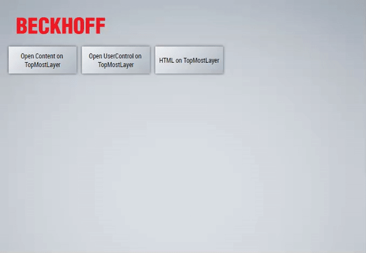

# Simple example of using the TcHmi.TopMostLayer

## Disclaimer
This is a personal guide not a peer reviewed journal or a sponsored publication. We make
no representations as to accuracy, completeness, correctness, suitability, or validity of any
information and will not be liable for any errors, omissions, or delays in this information or any
losses injuries, or damages arising from its display or use. All information is provided on an as
is basis. It is the reader’s responsibility to verify their own facts.

The views and opinions expressed in this guide are those of the authors and do not
necessarily reflect the official policy or position of any other agency, organization, employer or
company. Assumptions made in the analysis are not reflective of the position of any entity
other than the author(s) and, since we are critically thinking human beings, these views are
always subject to change, revision, and rethinking at any time. Please do not hold us to them
in perpetuity.

## Overview 
This is a simple example showing 3 different types of "content" with TcHmi.TopMostLayer.addEx(). This shows UserControl, Content and plain HTML.    

## Getting Started
The Content and UserControl are linked to PLC variables so be sure to activate and download the PLC program first.  Then open Desktop.view in live view. 

## Screenshot


## Code Snippets
The following sections of code are the important parts. 

Content
```javascript
// instantiates the content in memory
var content = TcHmi.ControlFactory.createEx(
    'TcHmi.Controls.System.TcHmiRegion',
    'MyUc',
    {
        'data-tchmi-target-content':'MyContent.content',
        'data-tchmi-width': 170,
        'data-tchmi-height': 120,
        'data-tchmi-width-mode' : "Content"
    }
);

// creates a top most layer using the content
TcHmi.TopMostLayer.addEx(content.getElement(), {
    centerHorizontal: true,
    centerVertical: true,
    closeOnBackground: true,
    removeCb: (data) => {
        if (data.canceled) {
            console.log('canceled');
        }
    	content.destroy();
    }
});
```

UserControl
```javascript
// instantiates the user control in memory
var userControl = TcHmi.ControlFactory.createEx(
    'TcHmi.Controls.System.TcHmiUserControlHost',
    'MyUc',
    {
        'data-tchmi-target-user-control':'MyUserControl.usercontrol',
        'data-tchmi-width': 145,
        'data-tchmi-height': 110,
        'data-tchmi-width-mode' : "Content"
    }
);

// links the mySwitch usercontrol parameter with the PLC variable plcBool
TcHmi.Binding.createEx('%s%PLC1.MAIN.plcBool%/s%','setMySwitch',userControl);

// creates a top most layer with the usercontrol as the content
TcHmi.TopMostLayer.addEx(userControl.getElement(), {
    centerHorizontal: true,
    centerVertical: true,
    closeOnBackground: true,
    removeCb: (data) => {
        if (data.canceled) {
            // top most layer is canceled
        }
    	userControl.destroy();
    }
});
```

Plain HTML
```javascript
var myPopup = $('<div style="background:white;padding:10px;">Hello World<div>');
TcHmi.TopMostLayer.add(this, myPopup, {
    centerHorizontal: true,
    centerVertical: true,
    removeCb: (data) => {
        if (data.canceled) {
            // user clicked on background
        }
    }
});
```

## Versions
* TcXaeShell 3.1.4024.32
* TE2000 1.12.756.1

## Need more help?
Please visit http://beckhoff.com/ for further guides
